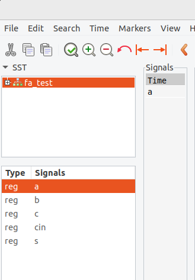

<div align="center">
  <h1>Embedded-Systems-VHDL-Assignments</h1>
</div>


<h2>Running VHDL Programs in Ubuntu</h2>

To run VHDL programs in Ubuntu, follow these steps & type the commands in terminal.

## Step 1: Update Package Lists. (Optional but recommended)
  ```bash
  sudo apt update
  ```


## Step 2: Install ghdl.
  ```bash
 sudo apt install ghdl -y
  ```
## Step 3: Install gtkwave.
  ```bash
 sudo apt install gtkwave -y
  ```
You can check if ghdl and gtkwave have been installed or not by typing the following commands,
  ```bash
  ghdl --version
  gtkwave --version
  ```

  If their versions show up they have been installed; otherwise there may have been some problems during installation.

## Step 4: Navigate to Program Directory
Use commands like ls and cd to navigate to the directory containing the VHDL program.

## Step 5: Compile and Generate Results
  ```bash
 make
  ```
## Step 6: Visualizing the program.
  ```bash
 gtkwave result.vcd
  ```
Now, gtkwave will open, allowing you to visualize the results (waveform) of your VHDL program.

## Step 7: Inside gtkwave select the testbench.


## Step 8: Select the listed signals. (By double clicking at each of them)


## Step 9: Initialize the visualiztion of waveform by clicking at the tick mark.


You can zoom in & zoom out the waveform by clicking '+' & '-' respectively.
