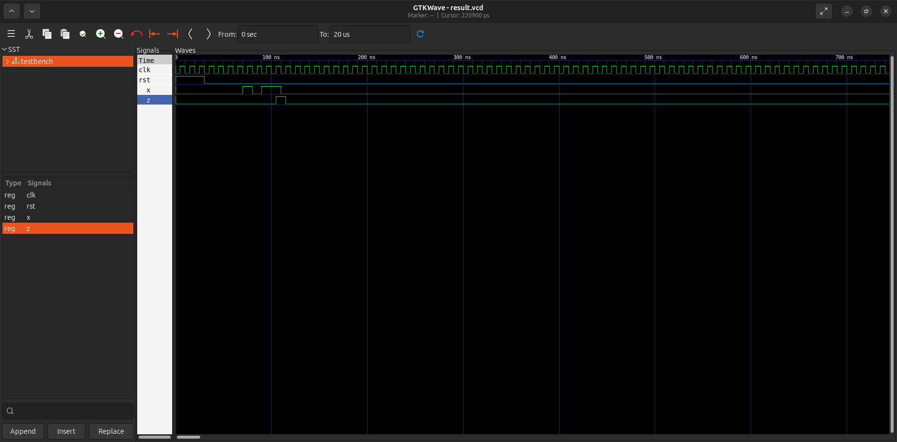
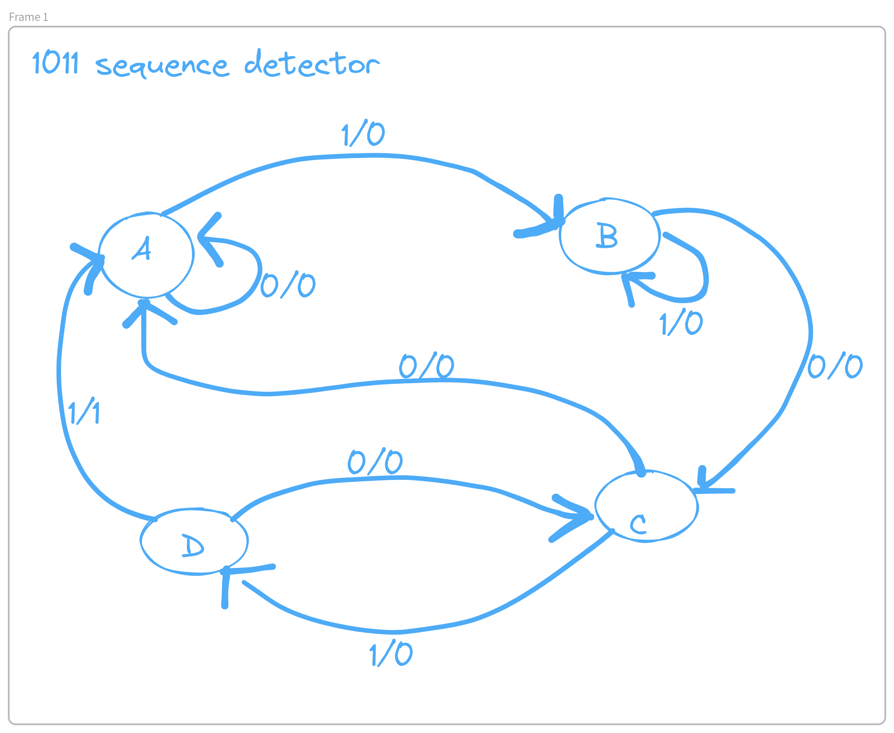

<h1>SEQUENCE DETECTION</h1>
<h2>2078 Chaitra</h2>

Draw the state diagram for a sequence detector for the sequence 1011 and then develop a VHDL code based on the state diagram. 

<h2>State Diagram</h2>

